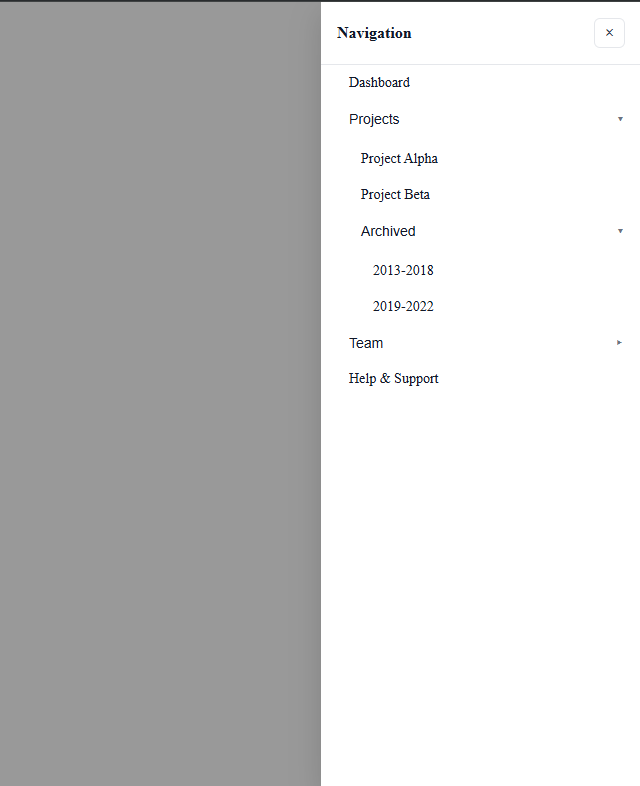

# React Component Library (Storybook)

A small UI component set built with **Vite + React + TypeScript + Storybook**.  
Implements three reusable components and showcases their states in Storybook.

---

## ✨ Components

- **Input**
  - Types: `text`, `password` (with visibility toggle), `number`
  - `clearable` “X” button
  - Notes: supports `defaultValue` for initial text
- **Toast**
  - Types: `success`, `info`, `warning`, `error`
  - Bottom-right position via `ToastContainer`
  - Auto-dismiss by `duration` (set `0` to disable), optional close button
  - Smooth fade/slide transition
- **Sidebar Menu**
  - Slides in from the right
  - Nested submenus (expand/collapse)
  - Closes on backdrop click

---

## 🧱 Tech Stack

- **Vite** (React + TypeScript)
- **Storybook** (with Controls/Actions)
- **ESLint + Prettier**

No external UI libraries.

---

## 🚀 Getting Started

```bash
# 1) Install deps
npm install

# 2) Run Storybook (component playground)
npm run storybook
# opens at http://localhost:6006

# (optional) type-check & lint
npm run lint
tsc --noEmit
```

---

## 📂 Suggested Structure

```
src/
├─ components/
│  ├─ Input/
│  ├─ Toast/
│  └─ SidebarMenu/
├─ stories/
└─ screenshots/
```

## 🧪 Storybook Coverage

- **Input**

  - Text / Password (toggle) / Number
  - Clearable / Disabled
  - Actions log for `onChange` in the **Actions** panel

- **Toast**

  - Variants: success, info, warning, error
  - Different durations, no auto-dismiss, no close button
  - Stacked example

- **Sidebar Menu**

  - One-level items
  - Two-level nested items
  - Open/closed states

---

## 🖼️ Screenshots

### Input


### Toast


### Sidebar Menu




---

## 🔧 Development Notes

- Components are **functional** with hooks and typed props.
- `defaultValue` on `Input` sets the **initial value only** (on first mount).
- Toast close timing is tied to the end of the **transition** to ensure consistent `onClose`.
- Sidebar closes via **backdrop click** and supports nested expand/collapse.

---
